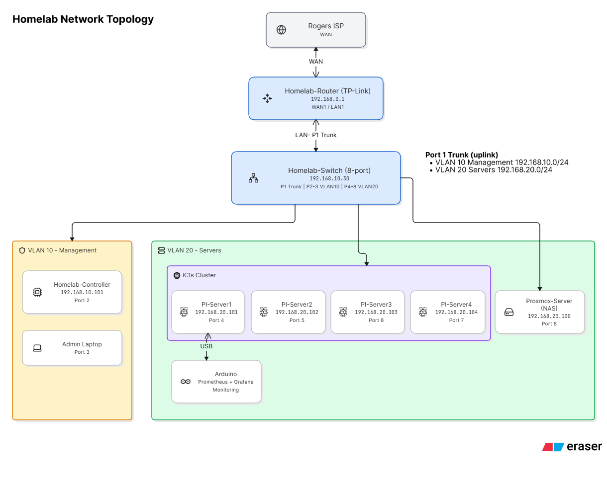

# Sidhants-Homelab


Welcome to my homelab project.

This repository documents my journey building and expanding a personal homelab — a real, hands-on environment for learning networking, Linux, infrastructure, monitoring, containerization, and Kubernetes.

Coming from a background in Nokia networking, I wanted a place to apply what I already know and push into areas I haven't worked with before. This is a living project: the hardware, network design, and services here will keep changing as I learn.

Each major area of the lab (Cisco, Omada, Raspberry Pi, monitoring, troubleshooting, projects) has its own directory with detailed documentation. This README is the map — it tells you what's here and points you to where the details live.

---

## 🎯 Why I'm Building This

I wanted to move past simulations and labs and work with real equipment that has real consequences when something breaks.

Goals for this project:

- Build and maintain a real, segmented network
- Get more hands-on experience with Cisco equipment
- Learn and implement VLANs and network segmentation
- Work with TP-Link Omada SDN equipment
- Build a Raspberry Pi–based infrastructure cluster
- Strengthen Linux administration skills
- Learn monitoring and observability (Prometheus/Grafana)
- Learn containerization and Kubernetes (K3s cluster is live)
- Practice troubleshooting real infrastructure problems
- Document the process — successes and failures — using Git and GitHub

---

## 🖥️ Hardware

| Category | Hardware |
|---|---|
| ISP Gateway| Rogers Router |
| Router | TP-Link ER605 (Homelab-Router, 192.168.0.1) |
| SDN Controller | TP-Link OC200 (Homelab-Controller, 192.168.10.101) |
| Core Switch | Cisco Catalyst WS-C3850-24T-E (data-only, no PoE), 192.168.10.30 |
| Compute | 4x Raspberry Pi 4 (K3s cluster) |
| Virtualization | Proxmox Server — repurposed PC (32GB RAM, 500GB SSD), 192.168.20.100 |
| Microcontroller | Arduino (connected to PI-Server1 via USB for sensor data collection) |

---

## 🌐 Network Topology



The lab is segmented into two active VLANs. The Homelab-Router (TP-Link, 192.168.0.1) feeds the core switch (192.168.10.30) over a trunk on port 1:

- **VLAN 10 – Management** (192.168.10.0/24): Homelab-Controller (.101), Admin Laptop
- **VLAN 20 – Servers** (192.168.20.0/24): 4x Raspberry Pi K3s cluster (.101–.104), Proxmox Server (.100)

Full topology history and diagrams live in [`./Network/`](./Network/).

---

## 🔢 VLANs

| VLAN | Name | Network | Status |
|---|---|---|---|
| 10 | Management | 192.168.10.0/24 | 🟢 Active |
| 20 | Servers | 192.168.20.0/24 | 🟢 Active |
| 30 | Clients | TBD | 🔵 Planned |
| 40 | IoT | TBD | 🔵 Planned |
| 50 | Cyber Lab | TBD | 🔵 Planned |

Management devices (OC200, switch management, admin laptop) sit on VLAN 10. All server infrastructure (Raspberry Pis, Proxmox) sits on VLAN 20. Detailed VLAN design and DHCP configuration are documented in [`./Network/`](./Network/).

---

## 🔌 Cisco Equipment

The Cisco Catalyst 3850 is the core switch for the lab, currently used as a Layer 2 switch — VLANs, trunking, access ports, 802.1Q, MAC/ARP tables. The uplink trunk (Gi1/0/1) carries VLAN 10 and VLAN 20. Layer 3 inter-VLAN routing is not in use on the switch yet; the TP-Link router handles routing for now.

Configs live in [`./Cisco/Configs`](./Cisco/Configs)

---

## 📡 Omada Equipment

The ER605 (router) and OC200 (SDN controller) form the Omada side of the network, with an EAP650 access point planned but not hooked up yet. Getting the OC200 and ER605 adopted and communicating across the Cisco trunk involved a fair amount of troubleshooting — VLAN migration, controller connectivity, and mixed-vendor quirks between Omada and Cisco.

Since Omada is mostly GUI-configured, its documentation is screenshot- and decision-based rather than config files. See [`./Omada/`](./Omada/).

---

## 🥧 Raspberry Pi Cluster

The lab runs a **4-node K3s Kubernetes cluster** on Raspberry Pi 4s, all on VLAN 20 with SSH enabled:

| Node | IP | Role |
|---|---|---|
| pi-server1 | 192.168.20.101 | K3s agent — Arduino attached via USB |
| pi-server2 | 192.168.20.102 | K3s agent |
| pi-server3 | 192.168.20.103 | K3s server (control plane) |
| pi-server4 | 192.168.20.104 | K3s agent |

The Arduino sensor exporter runs as a containerized workload in the cluster (pinned to pi-server1), and the monitoring stack lives in-cluster too (see below).

Setup notes and hardware details are in [`./Raspberry-Pi/`](./Raspberry-Pi/).

---

## 📊 Monitoring

Prometheus and Grafana run **inside the K3s cluster** via `kube-prometheus-stack` (namespace `monitoring`):

- Node metrics from all four Pis via node-exporter
- Custom `arduino-exporter` pod (pinned to pi-server1, reads the Arduino over `/dev/ttyACM0`) exposing temperature, humidity, and heat-index metrics, scraped by Prometheus via a ServiceMonitor
- Grafana dashboards, including a custom **Homelab-Thermo** dashboard for the Arduino sensor data and per-node compute views for the cluster
- **Headlamp** — in-cluster Kubernetes dashboard (namespace `headlamp`, NodePort `30937`), token login via a `headlamp-admin` ServiceAccount
- **Alertmanager** — email alerts via Gmail SMTP: node down, disk/memory/CPU pressure, pod crash-looping, Arduino temperature over 30°C, and sensor-stale detection, driven by a custom `PrometheusRule` (`homelab-custom-alerts`)

---

## 🛠️ Troubleshooting

A core part of this project is documenting problems, not just working configs — VLAN migrations, OC200/ER605 adoption issues, DHCP quirks, and mixed-vendor telemetry limitations between Cisco and Omada. Each writeup covers the problem, investigation steps, root cause, and fix. See [`./Troubleshooting/`](./Troubleshooting/).

---

## 🧪 Projects Completed

- [x] Initial network build (Rogers gateway → ER605 → Cisco 3850)
- [x] Cisco 3850 added and configured as core switch
- [x] VLAN 10 management network deployed
- [x] VLAN 20 server network deployed (K3s Pis + Proxmox)
- [x] OC200 adopted and migrated onto the management VLAN
- [x] ER605 adoption and Omada controller connectivity resolved
- [x] Arduino connected to a Pi for data collection
- [x] 4-node K3s Kubernetes cluster built (1 server + 3 agents)
- [x] Prometheus + Grafana deployed in-cluster via kube-prometheus-stack
- [x] Arduino sensor exporter containerized and running in K3s
- [x] Proxmox virtualization host added on VLAN 20
- [x] Headlamp Kubernetes dashboard deployed in K3s (NodePort 30937, token auth)
- [x] Alertmanager email alerting configured (node/sensor/resource alerts via Gmail SMTP)

---

## 📚 Currently Learning

**Networking:** VLANs, 802.1Q trunking, Layer 2/3 concepts, DHCP, ARP, Cisco IOS, Omada SDN
**Linux:** administration, SSH, services, system monitoring
**Infrastructure:** Kubernetes (K3s) workloads and Helm, Raspberry Pi cluster management, Proxmox virtualization, monitoring, troubleshooting mixed-vendor networks
**Other:** Git/GitHub documentation workflow, containerization

---

## 🚀 Future Plans

- **Pi-hole** — network-wide ad blocking and DNS, running in K3s
- **NAS / Storage** — network storage and backups (Proxmox host / Pi hardware)
- **IoT VLAN (40)** — isolated network for Arduino/sensor projects
- **Cybersecurity Lab (50)** — isolated environment for security testing and traffic analysis

---

## 📁 Repository Structure

```text
Sidhants-Homelab/
├── README.md                  # Project overview (this file)
├── Cisco/
│   └── Configs                # Cisco Catalyst 3850 running-config (secrets redacted)
├── Docs/
│   └── Helpful-Links.md       # Useful documentation links
├── K3s/
│   ├── README.md              # Cluster services: Headlamp, Alertmanager
│   └── manifests/             # Applied manifests (PrometheusRule, AlertmanagerConfig)
├── Network/
│   ├── README.md                    # Switch and VLAN setup notes
│   ├── Cisco-port-layout.png        # Physical port map
│   └── Updated_Topo.png  # Current topology diagram
├── Omada/
│   ├── README.md                    # Omada notes
│   └── Homelab-Omada-Setup Guide.pdf
├── Raspberry-Pi/
│   └── README.md              # Pi hardware + K3s cluster notes
└── Troubleshooting/
    └── README.md              # Problem writeups (VLAN migration, adoption issues, …)
```

---

## 📖 Documentation Philosophy

This repo documents the process, not just the end result — what I set out to do, how I built it, what went wrong, how I fixed it, and what I'd do differently. Sensitive information (passwords, keys, credentials) is never committed.

---

This repository will keep evolving as the homelab grows.
